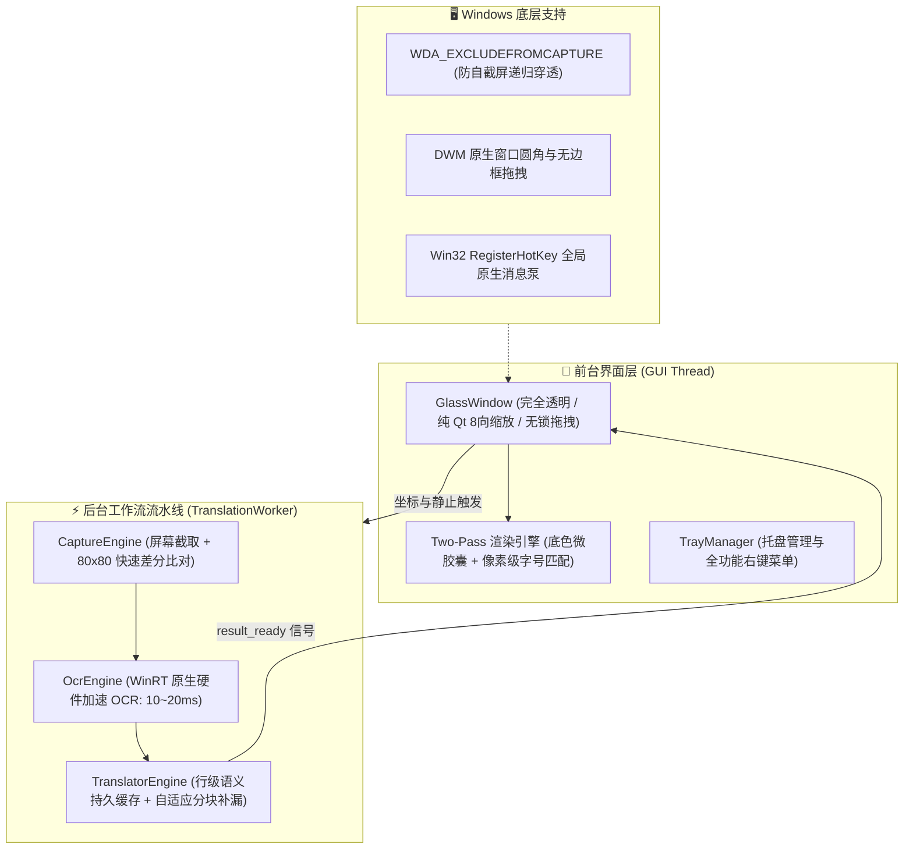

# 🪟 GlassTranslate (透视翻译器)

<div align="center">

**[简体中文](README.md)** • **[English](docs/README_EN.md)** • **[日本語](docs/README_JA.md)** • **[한국어](docs/README_KO.md)**

<br/>


-brightgreen)
-blue)


**专为 Windows 打造的无边框透明玻璃实时透视翻译器**  
*摆脱繁琐的“截图 - 划词 - 弹窗查看”，把取景框覆盖在文字上方，原文原地秒变中文！*

[✨ 核心特性](#-核心特性) • [🚀 快速开始](#-快速开始) • [🎮 交互与快捷键](#-交互与快捷键) • [⚙️ 右键控制中心](#️-右键控制中心概览) • [🏗️ 架构设计](#️-架构设计) • [❓ 常见问题](#-常见问题)

</div>

---

## 🌟 为什么选择 GlassTranslate？

在阅读外语文献、浏览海外技术文档、玩未汉化游戏、查阅英文代码或看外语生肉视频时，传统的划词插件或截图翻译软件往往需要繁琐的多步操作，且会弹出突兀的卡片窗口打断视线。

**GlassTranslate** 提供了一种极其优雅的“透视感”体验：
- 就像在桌面上**放置了一块完全透明的取景玻璃**；
- 框内的外文字符会被**原地精准替换为优美排版的中文**；
- 底层背景、视频画面、软件界面完全保持原样，视野零遮挡；
- 窗口移动时如纯净玻璃般瞬间清空，落位后**0 毫秒吸附命中缓存**，瞬间呈现翻译！

---

## ✨ 核心特性

### 1. 🪟 极致纯净的透明取景体验
- **无标题栏、无常驻外边框**：全窗口 100% 透明，仅保留四角青蓝极简对焦标。
- **原地文字智能替换 (In-Place Translation)**：提取框内文字的真实屏幕物理坐标，自动采样文字周边底色与明度，以两遍绘制（Two-Pass）架构优雅覆盖微胶囊背景并渲染中文。
- **像移动一块纯净玻璃**：鼠标左键在框内任意位置按下即可平滑拖拽，**移动瞬间清屏为透明，松手落位瞬间智能吸附**，完全符合物理直觉。

### 2. ⚡ 0.6 秒极速秒开与零黑框体验
- **免临时解压即开即用**：告别传统 Python 打包单文件在每次启动时耗费 3~5 秒解压几十兆动态库至 `Temp` 的卡顿，原生秒开仅需 **~0.6s**。
- **纯原生 GUI**：完全隐藏 CMD 控制台窗口，启动绝不闪烁任何控制台黑框。
- **组件惰性加载与后台预热**：界面核心优先在 100ms 内瞬间呈现，重型引擎在后台 QThread 并行预热，界面丝滑无等待。

### 3. ⌨️ 全局唤出快捷键自由配置
- **多预设快速切换**：支持 `Alt+R`（默认）、`Alt+Q`、`Alt+W`、`Alt+D`、`Alt+Space`、`Ctrl+Shift+R`、`F4` 等主流常用热键。
- **按键动态录制弹窗**：支持在自定义按键弹窗中直接敲击任意组合键自动录入。
- **免重启热生效**：切换快捷键后，底层 Win32 全局热键监听线程无缝热重载，即刻生效。

### 4. 📑 长篇段落自适应分块与行对齐修复 (Chunking & Repair)
- **严格安全分块阈值**：将长篇文本严格切分为 360 字符以内的自适应微块，彻底杜绝接口隐式截断丢弃最后几段文字的问题。
- **行级行数比对与对齐修补**：当长文本分块返回行数发生微小偏差时，系统自动复用已对齐的行，并针对缺失行发起精准补译，保证多段落文献 **100% 完整无缺漏翻译**。

### 5. 🧠 行级/句子级智能语义持久缓存
- **微调移动 0ms 瞬间秒显**：不仅支持整段 MD5 缓存，更细化到每一行、每一句的独立语义指纹；
- **重音与变音符号模糊容错**：引入 `unicodedata` 变音折叠技术（如 `à->a`, `é->e`），即使轻微拖动取景框导致切边或标点微扰，**100% 命中缓存，零网络请求秒级贴合**！

### 6. ⚡ 毫秒级极速双通道与零 411 限流
- **Windows 原生硬件加速 OCR**：基于 Windows 10/11 WinRT 硬件 OCR 引擎，本地识别仅需 **10~20ms**，零 CPU 占用。
- **有道官方移动端生产通道**：单次请求仅需 **50~90ms**，彻底告别 Demo 接口频繁报错 `411 访问受限` 的烦恼。
- **智能多级容灾熔断**：移动端主通道 ➔ aidemo 熔断备用 ➔ MyMemory 多语种启发式兜底，永不宕机。

### 7. 🖱️ 8 向边缘自适应缩放与框内滚轮缩放
- **边缘感应 8 向平滑缩放**：鼠标划过边缘 14px 范围自动变为缩放手势，纯 Qt 状态机调度，杜绝 Win32 模态消息死锁。
- **框内鼠标锚点滚轮缩放**：鼠标在框内直接滚动滚轮，以鼠标所在光标为中心等比快速缩放取景范围。

### 8. 🌐 支持自定义大模型 (OpenAI / DeepSeek 等)
- 内置偏好设置面板，不仅支持内置高速引擎，还可自由接入自定义 API（如 OpenAI `gpt-4o-mini`、`deepseek-chat` 或本地 Ollama）。
- 配置窗口自适应舒适排版，模型输入与操作按钮完整舒展，支持鼠标无边框拖拽移动。

> 📦 **普通用户开箱即用**：无需安装 Python 或配置任何环境，直接前往 [👉 GitHub Releases 发行页](https://github.com/newHashub/glass_translate/releases) 下载 `GlassTranslate-v1.0.0-Windows-x64.zip` 解压即用！

---

## 🚀 快速开始

根据您的使用需求，选择对应方式：

### 方案一：普通用户免配环境版（推荐，免装 Python，解压即用）

适合不熟悉编程、希望直接使用的用户：
1. 前往 [👉 Releases 发行版页面](https://github.com/newHashub/glass_translate/releases)；
2. 下载预编译打包好的分发包 **`GlassTranslate-v1.0.0-Windows-x64.zip`**；
3. 解压到您电脑的任意位置（如 `D:\GlassTranslate`）；
4. 双击解压目录中的 **`一键生成桌面快捷方式.vbs`**（将在桌面生成专属的启动图标），或直接双击 **`GlassTranslate.exe`** 即可瞬间启动！

---

### 方案二：开发者源码运行与开发

适合熟悉 Python、希望阅读源码或进行二次开发的用户：

#### 1. 环境依赖
- **操作系统**：Windows 10 / Windows 11 (64位)
- **Python 版本**：Python 3.10+ (推荐 Python 3.12)

#### 2. 克隆代码与依赖安装
```bash
git clone https://github.com/newHashub/glass_translate.git
cd glass_translate
pip install -r requirements.txt
```

#### 3. 启动程序
- **便捷方式**：直接双击运行根目录下的 **`run.bat`**（自动检测环境、静默后台启动、无黑框）；
- **命令行方式**：
  ```powershell
  python main.py
  ```

---

### 📦 开发者本地打包独立应用 (EXE)
如果您修改了源代码，希望在本地将其编译为独立的免环境 EXE 应用：
- 双击运行根目录下的 **`build_exe.bat`**；
- 脚本将自动：
  1. 编译生成独立应用到 `dist\GlassTranslate\`；
  2. 在您本机的桌面创建/更新 **`GlassTranslate.lnk`** 快捷方式；
  3. 自动生成可直接分享给好友的免配置压缩包 `dist\GlassTranslate-v1.0.0-Windows-x64.zip`。

---

## 🎮 交互与快捷键

| 操作 / 快捷键 | 功能说明 |
| :--- | :--- |
| **Alt + R (或自定义快捷键)** | **全局快速呼出/隐藏**：在当前鼠标所在位置秒显/收起翻译框 |
| **框内按住左键拖拽** | 平滑移动取景框；按下瞬间清屏，松手瞬间吸附秒显译文 |
| **四周边缘按住拖拽** | 8 个方向自由调整取景框宽度与高度 |
| **鼠标在框内滑动滚轮** | 以鼠标为中心快速放大/缩小取景窗口（可在菜单中开启/关闭） |
| **在框内点击鼠标右键** | 唤出全能控制菜单（语言选择、快捷键配置、模式切换、API 配置等） |
| **双击系统托盘图标** | 快速显示 / 隐藏翻译框 |

---

## ⚙️ 右键控制中心概览

鼠标在框内右键或在任务栏右下角托盘图标右键均可唤出（**所有配置一键直达，零冗余弹窗**）：

- 🪟 **显示/隐藏翻译框**
- ⏸️ **实时自动翻译** (开启/暂停实时检测)
- ⚡ **立即识别刷新** (手动强制触发扫描)
- 🌐 **翻译语言 ➔** (包含英中、日中、韩中、法中、德中、俄中、西中、中英、中日、中韩等 **12 组快捷预设**，或点击 **“⚙️ 自定义自由选择...”** 呼出多语种任意互译面板)
- 🚀 **翻译引擎 ➔** (⚡ 有道官方直连 [默认]、🌐 MyMemory 免费通道、🤖 自定义大模型)
- 🔤 **显示模式 ➔** (原地文字替换 [默认] / 悬浮卡片字幕)
- 🔍 **译文字号 ➔** (紧凑 85%、标准 100% [默认]、稍大 115%、醒目 130%)
- ⏱️ **识别频率 ➔** (极速 200ms、均衡 300ms [默认]、节能 600ms、慢速 1000ms)
- ⌨️ **唤出快捷键 ➔** (快速切换预设或自定义快捷键录制)
- 🖱️ **框内滚轮缩放窗口** (勾选开关)
- 💡 **显示底部状态提示** (勾选开关，默认关闭保持极致通透)
- 📌 **窗口始终置顶** (勾选开关)
- 📋 **复制最新译文**
- 🔑 **自定义 API 配置...** (专为 OpenAI / DeepSeek / Ollama 用户准备的轻量端点与 Key 设置)
- ❌ **退出程序**

---

## 🏗️ 架构设计

本项目采用高响应、完全解耦的多线程异步流水线架构：



### 目录结构说明
```
glass_translate/
├── main.py              # 主入口 (秒开呈现、控制台隐藏、热键初始化、生命周期管理)
├── glass_window.py      # 玻璃质感透明视窗、自适应排版、事件状态机与设置弹窗
├── worker.py            # 后台高响应工作线程 (去抖检测、缓存秒显探针、并行预热调度)
├── capture_engine.py    # 屏幕捕获与图像像素变动差分检测引擎
├── ocr_engine.py        # Windows 原生 OCR (WinRT) 封装与按需延迟探测
├── translator_engine.py # 多引擎调度器 (移动端高速通道、长文本分块修补、行级语义缓存)
├── global_hotkey.py     # Win32 RegisterHotKey 全局原生热键线程 (支持组合键解析与热重载)
├── tray_manager.py      # 系统托盘图标管理与全局右键控制菜单 (图标单例缓存)
├── win32_utils.py       # 防截屏穿透、DWM 圆角与高 DPI 感知
├── config.py            # 本地配置管理器 (自适应缺省值与自动持久化)
├── run.bat              # 便携智能启动批处理脚本 (优先秒开版)
├── run.vbs              # 完全无黑框后台静默启动脚本
├── build_exe.bat        # 一键打包生成秒开版原生应用与快捷方式脚本
├── app_icon.ico         # 专属高分辨率玻璃质感应用图标
├── requirements.txt     # 项目 Python 依赖库声明
├── pytest.ini           # 单元测试自动化配置
├── LICENSE              # MIT 开源许可证
└── tests/               # 自动化单元测试套件 (覆盖排版、捕获、长文本分块、缓存、热键等)
```

---

## ❓ 常见问题 (FAQ)

<details>
<summary><b>Q1: 为什么移动翻译框时底层画面不会被翻译框本身遮挡？</b></summary>
本项目通过调用 Windows 底层 API <code>SetWindowDisplayAffinity(hwnd, WDA_EXCLUDEFROMCAPTURE)</code>，使翻译窗口在 Windows 的屏幕抓取流（BitBlt / DirectX / DWM）中被底层自动隐形穿透，彻底杜绝了“自截屏递归产生无限画中画”的问题。
</details>

<details>
<summary><b>Q2: 为什么我的文字排版不会遮挡上一行或字体过大？</b></summary>
内置自适应排版引擎会根据 OCR 提取的每行实际高度（<code>wh</code>）以及真实行间距（<code>pitch</code>），智能约束背景微胶囊的高度与行距，并采用“先画所有胶囊背景，再画所有文字”的两遍绘制（Two-Pass）技术，无论字体如何缩放均不会产生覆盖截断。
</details>

<details>
<summary><b>Q3: 长篇英文文章最后几段会不会漏掉？</b></summary>
不会。本项目具备段落自适应分块与行对齐修补技术。即使一次性框选数百词的大段落文本，引擎会自动按 360 字符以内的微块进行安全分发，并自动校验比对行数对齐缺失行，确保 100% 完整保留所有译文段落。
</details>

<details>
<summary><b>Q4: 是否需要付费申请 API Key？</b></summary>
不需要。默认搭载的有道官方移动端生产通道无需任何 API Key，开箱即用，无 411 频率限制；如果您有自己的私有大模型（如 OpenAI、DeepSeek 等），也可以随时在右键菜单中填入自己的 Key。
</details>

---

## 📄 开源许可证

本项目采用 [MIT License](LICENSE) 开源协议。欢迎提交 Issue 和 Pull Request！

如果你觉得这个项目对你有帮助，欢迎在 GitHub 上点一个 ⭐️ **Star** 支持一下！  
GitHub 仓库地址：[https://github.com/newHashub/glass_translate](https://github.com/newHashub/glass_translate)
