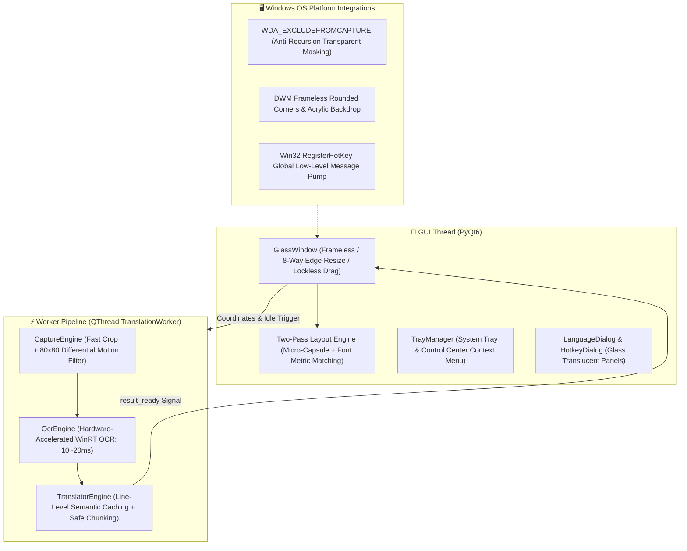

# 🪟 GlassTranslate

<div align="center">

**[English](README_EN.md)** • **[简体中文](README.md)** • **[日本語](README_JA.md)** • **[한국어](README_KO.md)**

<br/>


-brightgreen)
-blue)


**The Frameless Transparent Glass Real-Time Translation Lens for Windows**  
*Say goodbye to tedious "screenshot - select - popup reading". Just hover the glass viewfinder over foreign text, and it transforms into your native language in-place!*

[✨ Key Features](#-key-features) • [🚀 Quick Start](#-quick-start) • [🎮 Shortcuts & Controls](#-shortcuts--controls) • [⚙️ Control Menu](#️-control-menu-overview) • [🏗️ Architecture](#️-architecture) • [❓ FAQ](#-faq)

</div>

---

## 🌟 Why GlassTranslate?

When reading foreign research papers, browsing overseas technical documentation, playing non-localized games, inspecting source code, or watching videos without subtitles, traditional tools force you through a disruptive multi-step workflow: take a screenshot, highlight text, and read from a distracting popup box that obscures your work.

**GlassTranslate** delivers a seamless, physics-based "see-through" lens:
- Place a **100% transparent glass viewfinder** anywhere on your desktop;
- Foreign words inside the frame are **accurately replaced in-place** with clean, typography-matched translated text;
- The underlying background, video stream, and UI elements stay completely visible without jarring occlusion;
- Moving the window clears text instantly like pristine glass, and releasing it yields **instant 0ms cache-hit rendering**!

---

## ✨ Key Features

### 1. 🪟 Pure Minimalist Transparent Glass
- **No title bar, no intrusive border frames**: 100% transparent window body with subtle cyan focus corner indicators.
- **In-Place Typography-Matched Replacement**: Reads physical screen coordinates of detected lines, dynamically samples background luminosity and hue, and renders micro-capsule backgrounds with optimal contrast in a robust Two-Pass pipeline.
- **Intuitive Glass Physics**: Left-click anywhere inside the frame to drag smoothly. The frame wipes clean while moving and re-anchors translations seamlessly upon release.

### 2. ⚡ 0.6s Cold Start & Zero Console Flickering
- **No Temp Unpacking Delays**: Unlike traditional `--onefile` packaging that unpacks 70MB of DLLs into `AppData/Local/Temp` on every launch, the optimized standalone distribution launches instantly in **~0.6s**.
- **Pure Native GUI**: Console black boxes (`cmd.exe`) are suppressed from the earliest hook, ensuring a clean Windows desktop experience.
- **Parallel Background Pre-Warming**: The UI renders within 100ms, while heavy OCR and network engines warm up concurrently in background worker threads.

### 3. 🌐 12 Language Presets & Free Multilingual Dialog
- **12 Quick-Access Presets**: Instantly switch between English ➔ Chinese, Japanese ➔ Chinese, Korean ➔ Chinese, French ➔ Chinese, German ➔ Chinese, Russian ➔ Chinese, Spanish ➔ Chinese, Chinese ➔ English, Chinese ➔ Japanese, Chinese ➔ Korean, Auto ➔ English, and more.
- **`LanguageDialog` Custom Chooser**: Select freely from 14+ source languages and 11+ target languages with a single-click bidirectional swap button (`⇄`).
- **Dynamic WinRT OCR Language Matching**: Automatically resolves system-installed language packs (French, German, Russian, Spanish, Italian, Portuguese, Japanese, Korean, Chinese, English, etc.) without rigid hardcoding.

### 4. ⌨️ Global Hotkey Summon & Hot-Reload
- **Preset Quick Selection**: Defaults to `Alt+R`, with built-in presets for `Alt+Q`, `Alt+W`, `Alt+D`, `Alt+Space`, `Ctrl+Shift+R`, and `F4`.
- **Interactive Key Recording**: Built-in hotkey configuration dialog allows pressing any key combination to record dynamically.
- **Zero-Restart Hot-Reloading**: Switches Win32 system-wide hooks seamlessly on the fly.

### 5. 📑 Long Paragraph Auto-Chunking & Line Alignment
- **Strict Chunk Size Bounds**: Dynamically partitions large articles into safe micro-chunks (<=360 chars), eliminating API silent truncation on trailing sentences.
- **Line Count Parity & Targeted Repair**: If multi-line translations return differing line splits, matching lines are immediately preserved while unaligned lines receive pinpoint re-translation, ensuring 100% complete coverage without dropped sentences.

### 6. 🧠 Line-Level Persistent Semantic Caching
- **0ms Re-Render on Micro-Adjustments**: Caches translations not only at the full-block MD5 level, but also down to per-line semantic fingerprints.
- **Diacritic & Punctuation Fault Tolerance**: Employs `unicodedata` NFKD diacritic folding (e.g., `à->a`, `é->e`) so slight window jitters or punctuation shifts still achieve **100% instant cache hits** with zero network delay.

### 7. 🚀 Millisecond Dual-Channel Translation Pipeline
- **Windows Hardware-Accelerated OCR**: Native WinRT OCR processes high-resolution crops in **10~20ms** with virtually zero CPU overhead.
- **High-Throughput Main Channel**: Youdao Mobile official gateway responds in **50~90ms** without triggering 411 rate limits.
- **Multi-Tier Automated Failover**: Mobile Gateway ➔ aidemo Circuit-Breaker ➔ MyMemory Multilingual Fallback ➔ Custom LLM (OpenAI / DeepSeek / Ollama).

### 8. 🖱️ 8-Direction Edge Resizing & In-Frame Wheel Zoom
- **Smooth Edge Sensing**: Hovering within 14px of any edge or corner smoothly transitions the cursor to resize handles.
- **Anchor-Centered Wheel Zooming**: Scroll the mouse wheel inside the frame to expand or shrink the capture boundary centered around your cursor.

---

## 🚀 Quick Start

### Requirements
- **OS**: Windows 10 (Build 19041+) or Windows 11
- **Python**: Python 3.10+ (Python 3.12 recommended)

### 1. Clone the Repository
```bash
git clone https://github.com/newHashub/glass_translate.git
cd glass_translate
```

### 2. Run Application

#### Method A: Instant Native App (Recommended, ~0.6s cold start)
- Double-click **`GlassTranslate.lnk`** or run **`run.bat`** in the project root.
- Directly launches the standalone directory build at `dist/GlassTranslate/GlassTranslate.exe` with zero console popups.

#### Method B: Run from Source
```powershell
# 1. Install dependencies
pip install -r requirements.txt

# 2. Run main application
python main.py
```

### 📦 Build Standalone Windows Executable
To recompile the standalone executable after making modifications:
```powershell
.\build_exe.bat
```
This automatically compiles dependencies into `dist/GlassTranslate/` and creates the desktop shortcut `GlassTranslate.lnk`.

---

## 🎮 Shortcuts & Controls

| Shortcut / Action | Description |
| :--- | :--- |
| **Alt + R (or custom hotkey)** | **Global Summon/Dismiss**: Show or hide the translation viewfinder at cursor position |
| **Left-Click & Drag Inside Frame** | Smoothly moves the lens; clears frame on press and anchors translated text on release |
| **Hover & Drag on Edges/Corners** | 8-direction smooth sizing of the lens viewport |
| **Mouse Wheel Inside Frame** | Fast anchor-centered zooming of viewfinder size (toggleable in menu) |
| **Right-Click Inside Frame** | Opens the comprehensive Control Center menu |
| **Double-Click System Tray Icon** | Toggle show/hide for the translation window |

---

## ⚙️ Control Menu Overview

Right-click anywhere inside the frame or on the tray icon in the Windows taskbar:

- 🪟 **Show / Hide Viewfinder**
- ⏸️ **Real-time Auto Translation** (Enable/Pause automated scanning)
- ⚡ **Recognize Now** (Manually trigger a fresh capture)
- 🌐 **Translation Languages ➔** (12 quick presets, plus **`⚙️ Custom Language Selection...`** for free pairing)
- 🚀 **Translation Engine ➔** (⚡ Youdao Fast Official [Default], 🌐 MyMemory Free Channel, 🤖 Custom LLM API)
- 🔤 **Display Mode ➔** (In-Place Text Replacement [Default] / Floating Subtitle Card)
- 🔍 **Font Scale ➔** (Compact 85%, Standard 100%, Larger 115%, Bold 130%)
- ⏱️ **Scan Interval ➔** (Fast 200ms, Balanced 300ms [Default], Eco 600ms, Relaxed 1000ms)
- ⌨️ **Summon Hotkey ➔** (Select presets or open visual keybinding recorder)
- 🖱️ **In-Frame Mouse Wheel Zoom** (Toggle on/off)
- 💡 **Show Status Pill** (Toggle bottom indicator pill)
- 📌 **Always on Top** (Keep viewfinder pinned over other windows)
- 📋 **Copy Latest Translation**
- 🔑 **Custom LLM API Settings...** (Configure endpoint, key, and model for OpenAI, DeepSeek, or Ollama)
- ❌ **Exit Application**

---

## 🏗️ Architecture



### Directory Tree
```
glass_translate/
├── main.py              # Application entry point (silent startup, tray & hotkey dispatch)
├── glass_window.py      # Translucent viewport, custom dialogs, two-pass layout rendering
├── tray_manager.py      # System tray icon, unified right-click control menu, state sync
├── worker.py            # High-throughput background worker thread (debounce, caching probe)
├── capture_engine.py    # Desktop capture & differential pixel comparison
├── ocr_engine.py        # Windows WinRT native OCR with dynamic language tag resolution
├── translator_engine.py # Multi-gateway engine with semantic caching and chunking
├── config.py            # JSON configuration persistence & auto-save manager
├── global_hotkey.py     # Win32 RegisterHotKey message listener thread
├── win32_utils.py       # Acrylic blur, capture exclusion, and DWM window styling
├── build_exe.bat        # Automated one-click standalone packaging script
├── run.bat              # Rapid launcher script
└── tests/               # Pytest automated test suite (21/21 passing)
```

---

## 🧪 Testing

Run the automated test suite:
```powershell
pytest -v
```

---

## ❓ FAQ

**Q: Can I use this for playing foreign games or watching videos?**  
A: Yes! Simply place the transparent window over subtitles or game dialogues. Thanks to `WDA_EXCLUDEFROMCAPTURE`, the translation window itself is invisible to the capture engine, completely avoiding self-capture loops.

**Q: What if the translation doesn't match my target language?**  
A: Open the right-click menu, select **🌐 Translation Languages**, and pick any of the 12 presets or click **⚙️ Custom Language Selection...** to pair any source and target language freely.

**Q: Can I connect to DeepSeek or a local Ollama model?**  
A: Absolutely! Right-click and choose **🔑 Custom API Settings...**, select OpenAI compatibility, and enter your endpoint URL (e.g., `http://localhost:11434/v1/chat/completions` for Ollama or `https://api.deepseek.com/v1/chat/completions`).

---

## 📄 License

This project is licensed under the [MIT License](LICENSE).
