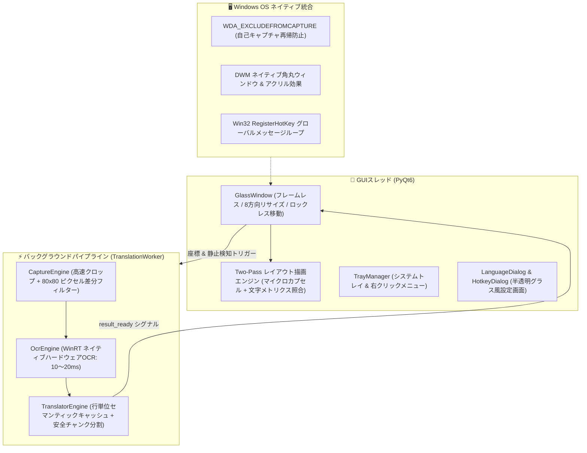

# 🪟 GlassTranslate (透視翻訳レンズ)

<div align="center">

**[日本語](README_JA.md)** • **[English](README_EN.md)** • **[简体中文](README.md)** • **[한국어](README_KO.md)**

<br/>


-brightgreen)
-blue)


**Windows 向けフレームレス透明リアルタイム透視翻訳ツール**  
*面倒な「スクショ → 範囲選択 → 別窓ポップアップ確認」はもう不要。透明フレームを文字の上に重ねるだけで、原文がその場で自然な日本語に変化します！*

[✨ 主な特長](#-主な特長) • [🚀 クイックスタート](#-クイックスタート) • [🎮 操作方法とショートカット](#-操作方法とショートカット) • [⚙️ 右クリックメニュー一覧](#️-右クリックメニュー一覧) • [🏗️ アーキテクチャ](#️-アーキテクチャ) • [❓ よくある質問](#-よくある質問)

</div>

---

## 🌟 GlassTranslate とは？

海外の技術論文やドキュメントの閲覧、未翻訳の洋ゲー、プログラミングコードの調査、海外動画の視聴時、従来の範囲選択プラグインやスクショ翻訳アプリでは、操作ステップが多く、画面を覆い隠すポップアップウィンドウが作業の集中を妨げていました。

**GlassTranslate** は、物理法則に基づいたまったく新しい「シースルー体験」を提供します：
- デスクトップ上に**100%透明なファインダーガラスを置く感覚**；
- 枠内の外国語テキストが、**その場で物理座標に合わせて綺麗に日本語へ置換**されます；
- 背景の動画やアプリ画面を遮ることなく、自然な視認性を維持；
- ウィンドウ移動時は純粋なガラスのように一瞬で透明化し、移動終了後は**0ミリ秒のキャッシュヒット**で即座に訳文を吸着表示！

---

## ✨ 主な特長

### 1. 🪟 徹底的に研ぎ澄まされた透明ファインダー
- **タイトルバーなし・常駐外枠なし**：ウィンドウ全体が完全透過。四隅のミニマルなシアン色フォーカスガイドのみを表示。
- **その場テキスト置換 (In-Place Translation)**：検出された文字行の物理座標を取得し、周囲の明度と背景色を自動サンプリング。Two-Pass 描画により美しく高コントラストなマイクロカプセル背景で翻訳テキストを描画します。
- **直感的なガラス操作感**：枠内のどこを左ドラッグしても滑らかに移動。移動中は瞬時に非表示、指を離した瞬間に再吸着します。

### 2. ⚡ 0.6 秒の爆速起動と黒いコンソール窓ゼロ
- **一時ファイル解凍待ちなし**：起動ごとに数十MBのDLLを `Temp` ディレクトリへ解凍する従来の単一EXE（3〜5秒の遅延）と異なり、最適化されたディレクトリ配置により**約0.6秒で爆速起動**。
- **純粋なネイティブGUI**：CMDコンソール黒窓を起動フックから完全隠蔽。画面のチラつきが一切ありません。
- **非同期バックグラウンド事前ウォームアップ**：UIシェルが100msで先に描画され、重厚なOCRエンジンや通信モジュールはバックグラウンドQThreadで並行初期化されます。

### 3. 🌐 12種類の言語プリセット＆自由なカスタム言語設定
- **12種類のワンクリックプリセット**：英語➔日本語、中国語➔日本語、韓国語➔日本語、フランス語➔日本語、ドイツ語➔日本語、英語➔中国語、日本語➔英語など多彩なプリセットを搭載。
- **`LanguageDialog` 自由ペア設定**：14以上のソース言語と11以上のターゲット言語から自由に選択可能。ワンクリックで翻訳方向を入れ替える（`⇄`）機能も搭載。
- **WinRT OCR 動的言語照合**：Windows システムにインストールされた言語パック（日本語、英語、中国語、フランス語、ドイツ語、ロシア語、スペイン語等）を動的に自動認識します。

### 4. ⌨️ グローバル召喚ショートカットの自由設定
- **豊富なプリセット切替**：デフォルトの `Alt+R` に加え、`Alt+Q`、`Alt+W`、`Alt+D`、`Alt+Space`、`Ctrl+Shift+R`、`F4` 等を標準サポート。
- **直感的なキーボード入力記録**：設定ダイアログで任意のキーを押すだけで自動キャプチャ。
- **再起動不要のホットリロード**：Win32 グローバルホットキーリスナーが即座に設定を切り替えます。

### 5. 📑 長文段落の自動分割と行ズレ修復 (Chunking & Repair)
- **安全なしきい値分割**：長い文章を360文字以下のマイクロブロックに自動分割し、APIによる末尾段落の欠落を完全に防止。
- **行数照合とピンポイント再補正**：翻訳結果の行数に微細な不一致が生じた場合、一致する行をそのまま活かしつつ、未整合の行のみを追加翻訳。100% 欠落のない完全な翻訳を実現します。

### 6. 🧠 行単位の永続的セマンティックキャッシュ
- **わずかな位置調整も 0ms で瞬間表示**：テキスト全体のMD5キャッシュに加え、1行・1文単位でセマンティックフィンガープリントを保存。
- **ダイアクリティカルマーク（変音記号）の吸収**：`unicodedata` NFKD 折衷アルゴリズム（例: `à->a`, `é->e`）により、ウィンドウのわずかなズレや記号の揺らぎがあっても**100%キャッシュヒット**し、ネットワーク遅延ゼロで表示されます。

### 7. 🚀 ミリ秒級デュアルチャネル翻訳パイプライン
- **Windows ハードウェアアクセラレーション OCR**：Windows 10/11 の WinRT OCR を直接呼び出し、高解像度キャプチャを **10〜20ms**、CPU負荷ほぼゼロで高速認識。
- **超高速有道公式モバイル通信**：1リクエストわずか **50〜90ms** で応答。Demo用APIの411アクセス頻度制限エラーのストレスから完全に解放。
- **多段階自動フェイルオーバー**：モバイルメイン回線 ➔ aidemo 回路ブレーカー ➔ MyMemory 多言語フォールバック ➔ カスタム LLM (OpenAI / DeepSeek / Ollama)。

### 8. 🖱️ 8方向境界リサイズ＆枠内マウスホイール拡大縮小
- **スムーズなエッジ判定**：ウィンドウ端 14px 以内にマウスを合わせると自動でリサイズカーソルに変形。
- **マウス位置中心のホイールズーム**：枠内でマウスホイールをスクロールするだけで、カーソル位置を中心にファインダーサイズを素早く伸縮可能（設定でON/OFF切替可能）。

---

## 🚀 クイックスタート

### 動作環境
- **OS**: Windows 10 (Build 19041 以降) または Windows 11
- **Python**: Python 3.10+ (Python 3.12 推奨)

### 1. リポジトリのクローン
```bash
git clone https://github.com/newHashub/glass_translate.git
cd glass_translate
```

### 2. アプリの起動

#### 方法 A: スタンドアロン実行版（推奨・0.6秒起動・黒窓なし）
- プロジェクトルートにある **`GlassTranslate.lnk`** または **`run.bat`** をダブルクリック。
- 解凍待ちなしで `dist/GlassTranslate/GlassTranslate.exe` が即座に立ち上がります。

#### 方法 B: Python ソースコードから起動
```powershell
# 1. 依存関係のインストール
pip install -r requirements.txt

# 2. アプリの実行
python main.py
```

### 📦 Windows ネイティブ EXE のワンクリックビルド
コード変更後にスタンドアロン実行ファイルを再ビルドしたい場合：
```powershell
.\build_exe.bat
```
依存ライブラリを `dist/GlassTranslate/` に一括出力し、デスクトップショートカット `GlassTranslate.lnk` を更新します。

---

## 🎮 操作方法とショートカット

| 操作 / ショートカット | 機能説明 |
| :--- | :--- |
| **Alt + R (または設定したキー)** | **グローバル呼び出し/非表示**：マウスカーソルの現在位置にファインダーを即座に表示/収納 |
| **枠内を左ボタンドラッグ** | ファインダーを滑らかに移動。押下時は瞬時に非表示、離すと即座に訳文を再配置 |
| **ウィンドウ枠の端・四隅をドラッグ** | 8方向にファインダーのサイズを自由に調整 |
| **枠内でマウスホイールを回転** | マウス位置を中心にファインダーサイズを素早くズーム（メニューで切替可能） |
| **枠内で右クリック** | フル機能のコントロールセンターメニューを表示 |
| **タスクトレイアイコンをダブルクリック** | 翻訳ファインダーの表示/非表示を切り替え |

---

## ⚙️ 右クリックメニュー一覧

ファインダー内での右クリック、またはタスクバー右下のトレイアイコン右クリックで表示：

- 🪟 **翻訳枠の表示 / 非表示**
- ⏸️ **リアルタイム自動翻訳** (自動スキャン機能の有効/一時停止)
- ⚡ **今すぐ認識して更新** (手動で強制スキャン)
- 🌐 **翻訳言語 ➔** (12種類のプリセット、または **`⚙️ カスタム言語選択...`** で自由設定)
- 🚀 **翻訳エンジン ➔** (⚡ 有道公式高速回線 [デフォルト]、🌐 MyMemory 無料回線、🤖 カスタム大規模言語モデル)
- 🔤 **表示モード ➔** (その場テキスト置換 [デフォルト] / フローティング字幕カード)
- 🔍 **フォントサイズ ➔** (コンパクト 85%、標準 100%、やや大きめ 115%、特大 130%)
- ⏱️ **認識間隔 ➔** (超高速 200ms、バランス 300ms [デフォルト]、省電力 600ms、ゆったり 1000ms)
- ⌨️ **呼び出しショートカット ➔** (プリセット選択またはキーボード入力記録)
- 🖱️ **枠内マウスホイール拡大縮小** (チェックボックスON/OFF)
- 💡 **下部ステータス表示** (チェックボックスON/OFF、デフォルトOFFで極上の透明感を維持)
- 📌 **常に最前面に固定** (ピン留め)
- 📋 **最新の翻訳テキストをコピー**
- 🔑 **カスタム API 設定...** (OpenAI、DeepSeek、ローカル Ollama 用のエンドポイント・Key・モデル設定)
- ❌ **アプリを終了**

---

## 🏗️ アーキテクチャ



---

## 🧪 テストの実行

自動テストスイートを実行して動作を検証できます：
```powershell
pytest -v
```

---

## ❓ よくある質問

**Q: 海外のPCゲームや動画視聴でも使えますか？**  
A: はい！ゲームの会話字幕や動画の上に透明ウィンドウを重ねるだけで使用できます。`WDA_EXCLUDEFROMCAPTURE` により、自分自身の翻訳ウィンドウはスクリーンキャプチャから除外されるため、画面がチラつくことなく安定して動作します。

**Q: 日本語以外の言語同士の翻訳もできますか？**  
A: もちろん可能です。右クリックメニューから **🌐 翻訳言語** ➔ **⚙️ カスタム言語選択...** を開くことで、英語、中国語、韓国語、フランス語、ドイツ語、ロシア語、スペイン語など世界各国の言語を自由に組み合わせて翻訳できます。

**Q: ローカルの Ollama や DeepSeek API に繋ぐことはできますか？**  
A: 可能です。右クリックの **🔑 カスタム API 設定...** を開き、エンドポイントURL（例: Ollama の場合は `http://localhost:11434/v1/chat/completions`、DeepSeek の場合は `https://api.deepseek.com/v1/chat/completions`）と API キー、モデル名を入力して保存するだけで連携できます。

---

## 📄 ライセンス

本プロジェクトは [MIT License](LICENSE) のもとで公開されています。
