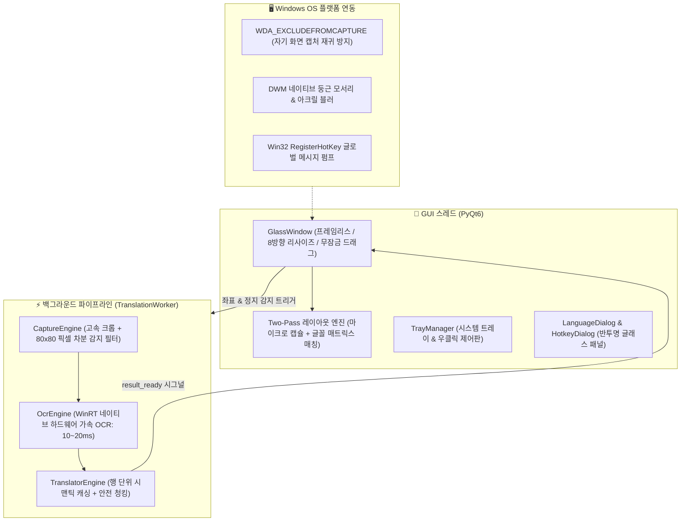

# 🪟 GlassTranslate (투시 번역기)

<div align="center">

**[한국어](README_KO.md)** • **[English](README_EN.md)** • **[日本語](README_JA.md)** • **[简体中文](../README.md)**

<br/>


-brightgreen)
-blue)


**Windows 전용 프레임리스 투명 유리 실시간 투시 번역 렌즈**  
*번거로운 "스크린샷 ➔ 영역 드래그 ➔ 팝업창 확인" 방식은 이제 그만! 투명 뷰파인더 창을 텍스트 위에 올려놓기만 하면, 원문이 제자리에서 즉시 자연스러운 한국어로 변환됩니다!*

[✨ 주요 기능](#-주요-기능) • [🚀 빠른 시작](#-빠른-시작) • [🎮 조작법 및 단축키](#-조작법-및-단축키) • [⚙️ 우클릭 제어판 안내](#️-우클릭-제어판-안내) • [🏗️ 아키텍처](#️-아키텍처) • [❓ 자주 묻는 질문](#-자주-묻는-질문)

</div>

---

## 🌟 왜 GlassTranslate인가요?

외국 학술 논문이나 해외 기술 문서를 읽을 때, 미한글화 해외 게임을 플레이할 때, 영문 코드를 검토하거나 자막 없는 해외 영상을 시청할 때, 기존의 영역 드래그 번역기나 스크린샷 캡처 도구는 수많은 클릭을 요구하고 작업 화면을 가리는 불투명한 팝업창을 띄워 집중을 방해합니다.

**GlassTranslate**는 물리 법칙에 기반한 완전히 새로운 "투시형 렌즈" 경험을 선사합니다:
- 바탕화면 위에 **100% 완전 투명한 렌즈 유리를 올려놓는 느낌**;
- 프레임 안의 외국어 텍스트가 화면 좌표에 맞춰 **원래 자리에서 깔끔하고 아름다운 한국어로 직접 교체(In-Place)**됩니다;
- 배경의 게임 그래픽, 비디오 영상, 프로그램 UI가 전혀 가려지지 않아 시야가 언제나 쾌적합니다;
- 창을 마우스로 드래그할 때는 순수한 유리처럼 즉시 투명해지고, 마우스를 떼는 순간 **0ms 캐시 히트**로 즉각 흡착 렌더링됩니다!

---

## ✨ 주요 기능

### 1. 🪟 극도로 순수한 투명 뷰파인더
- **타이틀 바 없음・외곽 프레임 없음**: 창 전체가 100% 완전 투명하며 모서리에 절제된 청록색 포커스 마크만 표시됩니다.
- **제자리 텍스트 인플레이스 교체 (In-Place Translation)**: 텍스트의 물리 좌표를 감지하여 배경 명도와 색상을 자동 샘플링한 후, Two-Pass 렌더링을 통해 가독성이 뛰어난 마이크로 캡슐 배경과 함께 텍스트를 출력합니다.
- **물리적 직관의 유리 조작감**: 창 내부 어디든 좌클릭 드래그로 부드럽게 이동할 수 있으며, 이동 중에는 투명해졌다가 손을 놓는 순간 정확히 번역문이 제자리를 찾습니다.

### 2. ⚡ 0.6초 초고속 콜드 스타트 & 검은 콘솔 창 제로
- **임시 폴더 압축 해제 딜레이 없음**: 실행할 때마다 수십 MB의 라이브러리를 `Temp` 폴더에 압축 해제하느라 3~5초씩 걸리던 기존 단일 EXE 패키징 방식과 달리, 최적화된 디렉터리 배포 방식으로 **약 0.6초 만에 즉시 실행**됩니다.
- **순수 네이티브 GUI**: 실행 시 깜빡이는 검은색 CMD 콘솔 창을 첫 진입점부터 완벽히 차단하여 매끄러운 윈도우 앱 경험을 제공합니다.
- **백그라운드 병렬 웜업**: 메인 UI 껍질이 100ms 이내에 즉각 렌더링되고, 무거운 WinRT OCR 및 네트워크 엔진은 백그라운드 QThread에서 병렬로 예열됩니다.

### 3. 🌐 12가지 언어 프리셋 및 자유로운 언어 선택창
- **12가지 원클릭 퀵 프리셋**: 영어 ➔ 한국어, 일본어 ➔ 한국어, 중국어 ➔ 한국어, 프랑스어 ➔ 한국어, 독일어 ➔ 한국어, 스페인어 ➔ 한국어, 러시아어 ➔ 한국어, 한국어 ➔ 영어 등 풍부한 프리셋 지원.
- **`LanguageDialog` 커스텀 선택 패널**: 14개 이상의 출발어와 11개 이상의 도착어를 자유롭게 조합 가능하며, 원클릭 방향 맞바꿈 버튼(`⇄`)을 제공합니다.
- **WinRT OCR 동적 언어 매칭**: Windows 시스템에 설치된 다양한 언어 팩(영어, 한국어, 일본어, 중국어, 프랑스어, 독일어, 스페인어, 러시아어 등)을 코드 하드코딩 없이 자동으로 인식합니다.

### 4. ⌨️ 글로벌 호출 단축키 자유 설정 & 핫 리로드
- **다양한 프리셋 지원**: 기본값인 `Alt+R`을 비롯하여 `Alt+Q`, `Alt+W`, `Alt+D`, `Alt+Space`, `Ctrl+Shift+R`, `F4` 등 지원.
- **대화형 단축키 입력 레코더**: 설정 창에서 원하는 키보드 조합을 누르기만 하면 즉시 감지하여 등록.
- **재시작 없는 즉시 적용(Hot-Reload)**: 단축키를 변경하는 즉시 Win32 글로벌 메시지 훅이 무중단으로 갱신됩니다.

### 5. 📑 긴 문단 자동 청킹 및 행 정렬 복구 (Chunking & Repair)
- **엄격한 안전 청크 기준**: 긴 문장을 360자 이하의 미세 블록으로 스마트하게 분할하여 API가 문장 뒷부분을 누락시키는 문제를 원천 차단합니다.
- **행 개수 대조 및 핀포인트 보정**: 번역 결과의 줄 바꿈이 원문과 달라지더라도 이미 일치하는 행은 유지하고 누락된 행만 정확히 핀포인트 재번역하여 **100% 누락 없는 완전한 번역**을 보장합니다.

### 6. 🧠 행 단위 영구 시맨틱 캐싱
- **미세한 창 이동 시 0ms 즉각 표시**: 문단 전체 MD5 캐시뿐만 아니라 개별 문장/행 단위의 독립적인 시맨틱 핑거프린트를 보관합니다.
- **발음 구별 기호(Diacritics) 정규화**: `unicodedata` NFKD 알고리즘(예: `à->a`, `é->e`)을 통해 뷰파인더 창이 살짝 흔들리거나 구두점이 변해도 **100% 캐시 히트**되어 네트워크 지연 없이 번역문이 표시됩니다.

### 7. 🚀 밀리초 수준의 듀얼 채널 번역 파이프라인
- **Windows 하드웨어 가속 OCR**: WinRT 네이티브 OCR을 활용하여 고해상도 영역도 **10~20ms** 만에 인식하며 CPU 점유율이 거의 없습니다.
- **초고속 모바일 공식 채널**: 단일 요청을 **50~90ms** 만에 처리하여 데모 API 특유의 411 빈도 제한 에러에서 완전히 자유롭습니다.
- **다단계 자동 장애 복구(Failover)**: 모바일 메인 채널 ➔ aidemo 쿨다운 서킷브레이커 ➔ MyMemory 다국어 폴백 ➔ 커스텀 대형 언어 모델(OpenAI / DeepSeek / Ollama).

### 8. 🖱️ 8방향 모서리 리사이즈 & 프레임 내 마우스 휠 줌
- **부드러운 경계선 감지**: 테두리 14px 범위에 마우스를 올리면 자동으로 리사이즈 커서로 전환됩니다.
- **커서 기준 마우스 휠 줌**: 프레임 안에서 마우스 휠을 굴리면 마우스 포인터 위치를 중심으로 뷰파인더 크기가 즉시 확대/축소됩니다(메뉴에서 ON/OFF 가능).

---

## 🚀 빠른 시작

### 요구 사양
- **운영체제**: Windows 10 (빌드 19041 이상) 또는 Windows 11
- **Python 버전**: Python 3.10 이상 (Python 3.12 권장)

### 1. 코드 복제
```bash
git clone https://github.com/newHashub/glass_translate.git
cd glass_translate
```

### 2. 프로그램 실행

#### 방법 1: 초고속 실행 단독 앱 (권장, 0.6초 즉시 실행, 콘솔 창 없음)
- 루트 디렉터리에 생성된 **`GlassTranslate.lnk`** 바로가기 또는 **`run.bat`** 파일을 더블클릭합니다.
- 압축 해제 과정 없이 `dist/GlassTranslate/GlassTranslate.exe`가 바로 실행됩니다.

#### 방법 2: Python 소스 코드 직접 실행
```powershell
# 1. 의존성 패키지 설치
pip install -r requirements.txt

# 2. 프로그램 실행
python main.py
```

### 📦 Windows 네이티브 실행 파일 빌드
코드를 수정한 후 단독 실행 파일 형태로 재컴파일하려면:
```powershell
.\build_exe.bat
```
자동으로 의존 라이브러리를 `dist/GlassTranslate/` 폴더에 빌드하고 바탕화면 바로가기 `GlassTranslate.lnk`를 생성합니다.

---

## 🎮 조작법 및 단축키

| 조작 / 단축키 | 기능 설명 |
| :--- | :--- |
| **Alt + R (또는 사용자 지정 키)** | **글로벌 호출/숨기기**: 현재 마우스 커서 위치에 번역 뷰파인더를 즉시 표시하거나 숨김 |
| **프레임 내부 좌클릭 드래그** | 뷰파인더 창 부드럽게 이동. 클릭 시 투명해지며 손을 놓는 순간 번역문 배치 |
| **창 모서리 및 테두리 드래그** | 8방향으로 뷰파인더의 가로/세로 크기 조절 |
| **프레임 내부 마우스 휠 스크롤** | 마우스 위치를 중심으로 창 크기를 빠르게 줌 인/줌 아웃 (메뉴에서 설정 가능) |
| **프레임 내부 우클릭** | 전체 기능 제어판 컨텍스트 메뉴 호출 |
| **시스템 트레이 아이콘 더블클릭** | 번역 뷰파인더 창 표시/숨기기 토글 |

---

## ⚙️ 우클릭 제어판 안내

뷰파인더 내부에서 우클릭하거나 작업표시줄 트레이 아이콘을 우클릭하면 나타납니다:

- 🪟 **번역 창 표시 / 숨기기**
- ⏸️ **실시간 자동 번역** (자동 감지 스캔 켜기/일시정지)
- ⚡ **지금 즉시 인식 및 새로고침** (수동 강제 스캔)
- 🌐 **번역 언어 ➔** (12가지 퀵 프리셋, 또는 **`⚙️ 사용자 지정 언어 선택...`** 패널 호출)
- 🚀 **번역 엔진 ➔** (⚡ 유도 공식 고속 회선 [기본값], 🌐 MyMemory 무료 채널, 🤖 커스텀 LLM API)
- 🔤 **표시 모드 ➔** (제자리 텍스트 교체 [기본값] / 플로팅 자막 카드 모드)
- 🔍 **글자 크기 ➔** (컴팩트 85%, 표준 100% [기본값], 크게 115%, 아주 크게 130%)
- ⏱️ **스캔 주기 ➔** (초고속 200ms, 균형 300ms [기본값], 절전 600ms, 여유 1000ms)
- ⌨️ **호출 단축키 ➔** (프리셋 선택 및 키보드 입력 레코더)
- 🖱️ **프레임 내 마우스 휠 줌** (체크박스 토글)
- 💡 **하단 상태 알림 바 표시** (체크박스 토글, 기본 OFF로 극도의 투명감 유지)
- 📌 **창 항상 위에 고정**
- 📋 **최신 번역 결과 복사**
- 🔑 **사용자 지정 API 설정...** (OpenAI, DeepSeek, Ollama 연동을 위한 엔드포인트/Key/모델 설정)
- ❌ **프로그램 종료**

---

## 🏗️ 아키텍처



---

## 🧪 테스트 실행

자동화 테스트를 실행하여 정상 작동 여부를 검증할 수 있습니다:
```powershell
pytest -v
```

---

## ❓ 자주 묻는 질문

**Q: 외국어 PC 게임이나 동영상 시청 중에도 사용할 수 있나요?**  
A: 네, 완벽히 지원합니다! 게임 대사창이나 영상 자막 위에 투명 창을 올려두기만 하면 됩니다. `WDA_EXCLUDEFROMCAPTURE` 기능 덕분에 번역기 창 자체가 캡처 화면에서 제외되어 무한 캡처 루프 없이 깔끔하게 작동합니다.

**Q: 한국어 외에 다른 언어끼리의 번역도 가능한가요?**  
A: 물론입니다. 우클릭 메뉴의 **🌐 번역 언어** ➔ **⚙️ 사용자 지정 언어 선택...**을 열어 영어, 일본어, 중국어, 프랑스어, 독일어, 스페인어, 러시아어 등 전 세계 다양한 언어를 자유롭게 조합하여 번역할 수 있습니다.

**Q: 로컬 Ollama나 DeepSeek 모델과 연결할 수 있나요?**  
A: 네, 지원합니다. 우클릭 후 **🔑 사용자 지정 API 설정...**을 클릭하고 엔드포인트 URL(예: Ollama의 경우 `http://localhost:11434/v1/chat/completions`, DeepSeek의 경우 `https://api.deepseek.com/v1/chat/completions`)과 API Key, 모델명을 입력하여 저장하면 됩니다.

---

## 📄 라이선스

본 프로젝트는 [MIT License](LICENSE)에 따라 배포됩니다.
